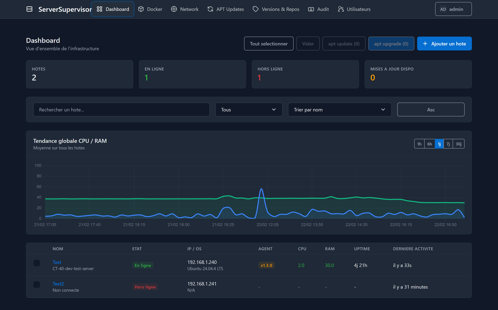
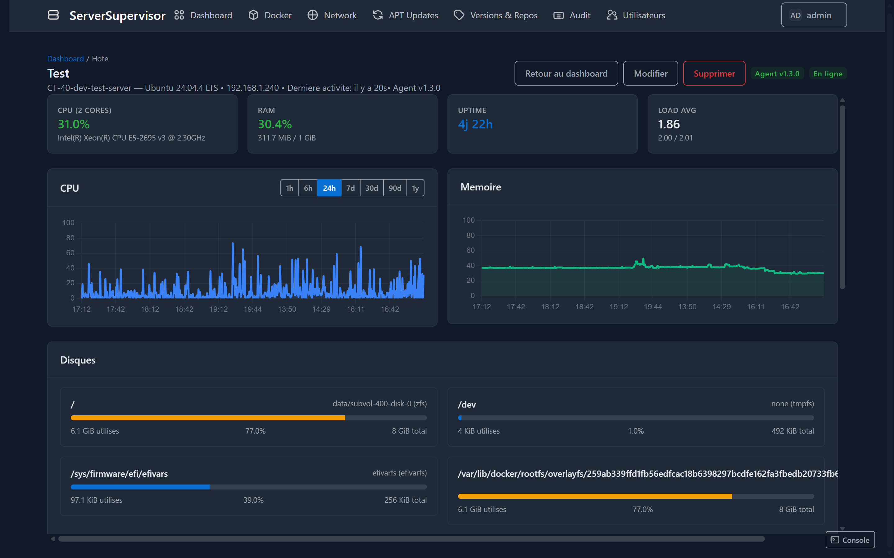
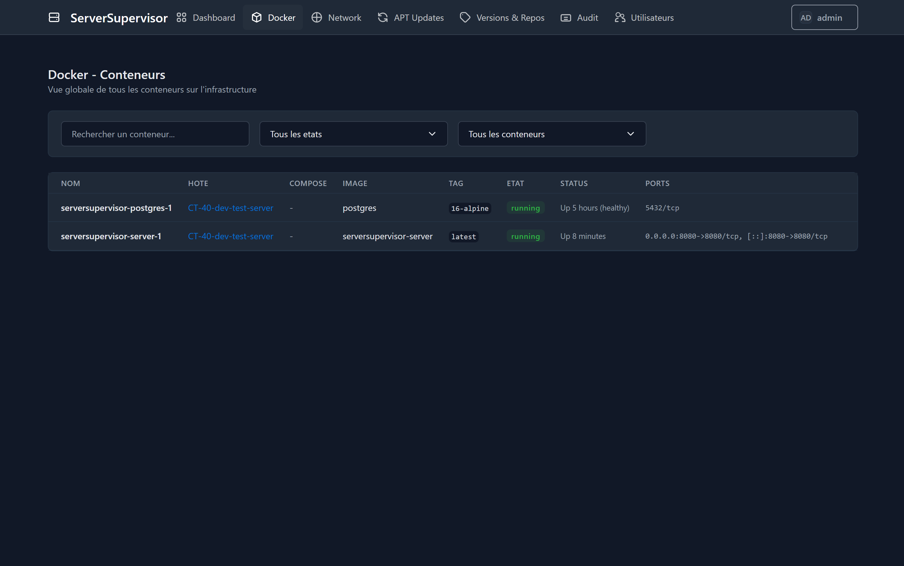
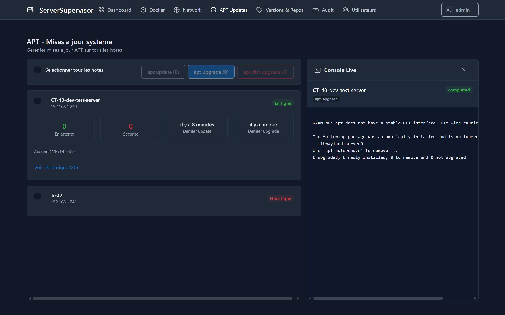
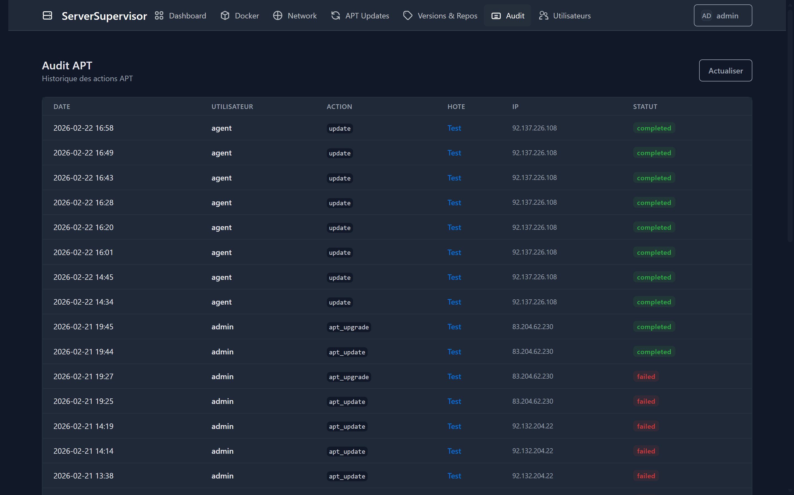

# ServerSupervisor

Système de supervision d'infrastructure : monitoring de VMs, conteneurs Docker, mises à jour APT et suivi des releases GitHub.

## Architecture

```
┌─────────────────────────────────────────────────────┐
│                   Dashboard (Vue.js)                │
│  ┌──────────┐ ┌──────────┐ ┌────────┐ ┌─────────┐  │
│  │ Hosts    │ │ Docker   │ │ Network│ │  APT    │  │
│  │ Dashboard│ │ Versions │ │ Ports  │ │ Console │  │
│  └──────────┘ └──────────┘ └────────┘ └─────────┘  │
│  ┌──────────┐ ┌──────────┐ ┌────────┐ ┌─────────┐  │
│  │ Alertes  │ │ Audit    │ │ Users  │ │ Security│  │
│  └──────────┘ └──────────┘ └────────┘ └─────────┘  │
├─────────────────────────────────────────────────────┤
│         Server Go (API REST + WebSocket + JWT)      │
│  ┌──────────┐ ┌──────────┐ ┌────────────────────┐  │
│  │ Auth+MFA │ │ Rate     │ │ GitHub Release     │  │
│  │ JWT+Keys │ │ Limiting │ │ Tracker            │  │
│  └──────────┘ └──────────┘ └────────────────────┘  │
│  ┌──────────┐ ┌──────────┐ ┌────────────────────┐  │
│  │ Alerts   │ │ Audit    │ │ Downsampling       │  │
│  │ Engine   │ │ Logs     │ │ Aggregates         │  │
│  └──────────┘ └──────────┘ └────────────────────┘  │
├─────────────────────────────────────────────────────┤
│                  PostgreSQL                         │
└─────────────────────────────────────────────────────┘
         ▲              ▲              ▲
    Push (30s)     Push (30s)     Push (30s)
         │              │              │
    ┌────┴────┐    ┌────┴────┐    ┌────┴────┐
    │ Agent   │    │ Agent   │    │ Agent   │
    │ (Go)    │    │ (Go)    │    │ (Go)    │
    │ VM-1    │    │ VM-2    │    │ VM-N    │
    └─────────┘    └─────────┘    └─────────┘
```

## Fonctionnalités

### Dashboard
- **Vue d'ensemble** : tous les hôtes avec statut temps réel (CPU, RAM, uptime)

- **Détail par hôte** : graphiques CPU/RAM historiques, disques, conteneurs, APT

- **Docker** : vue globale de tous les conteneurs sur toute l'infrastructure

- **Network** : ports exposés et trafic réseau par hôte et topologie réseau
- **APT** : gestion centralisée des mises à jour avec actions groupées et console live

- **Versions** : suivi des releases GitHub et comparaison avec les images Docker en cours
- **Audit** : logs d'actions utilisateurs et commandes système

- **Alertes** : règles d'alertes configurables avec notifications webhook/email

### Agent
- Collecte automatique : CPU, RAM, disque, réseau, uptime
- Monitoring Docker via CLI (pas de SDK requis)
- Détection des mises à jour APT disponibles
- Exécution de commandes APT poussées depuis le dashboard
- Binaire unique sans dépendances

### Sécurité
- Authentification JWT avec refresh tokens
- MFA/2FA (TOTP) optionnel
- API Keys uniques par agent avec rotation
- Rate limiting par IP avec support reverse proxy
- Audit logs des actions administrateur
- RBAC (admin/viewer)
- Support HTTPS et WebSocket sécurisés

## Démarrage rapide

### 1. Déployer le serveur

```bash
# Cloner le repo
git clone <repo-url> && cd ServerSupervisor

# Configurer
cp .env.example .env
# Éditer .env avec vos valeurs (JWT_SECRET, ADMIN_PASSWORD, etc.)

# Lancer
docker compose up -d
```

Le dashboard est accessible sur `http://localhost:8080` (login: admin/admin par défaut).

### 2. Enregistrer un hôte

1. Ouvrir le dashboard → **Ajouter un hôte**
2. Renseigner hostname, IP, OS
3. **Copier la clé API** affichée (elle ne sera plus visible)

### 3. Installer l'agent sur une VM

```bash
# Compiler l'agent (depuis la machine de dev)
cd agent
GOOS=linux GOARCH=amd64 go build -o serversupervisor-agent ./cmd/agent

# Copier sur la VM cible
scp serversupervisor-agent user@vm:/usr/local/bin/

# Sur la VM : créer la config
sudo mkdir -p /etc/serversupervisor
sudo cat > /etc/serversupervisor/agent.yaml <<EOF
server_url: "http://your-server:8080"
api_key: "la-clé-api-copiée"
report_interval: 30
collect_docker: true
collect_apt: true
EOF

# Installer le service systemd
sudo cat > /etc/systemd/system/serversupervisor-agent.service <<EOF
[Unit]
Description=ServerSupervisor Agent
After=network-online.target docker.service
Wants=network-online.target

[Service]
Type=simple
ExecStart=/usr/local/bin/serversupervisor-agent --config /etc/serversupervisor/agent.yaml
Restart=always
RestartSec=10

[Install]
WantedBy=multi-user.target
EOF

# Démarrer
sudo systemctl daemon-reload
sudo systemctl enable --now serversupervisor-agent

# Vérifier
sudo journalctl -u serversupervisor-agent -f
```

Ou utiliser le script d'installation :
```bash
sudo bash agent/install.sh --server-url http://your-server:8080 --api-key your-key
```

### 4. Suivre des repos GitHub

1. Dashboard → **Versions & Repos**
2. Ajouter un repo (ex: `home-assistant` / `core`)
3. Optionnel : associer un nom d'image Docker pour la comparaison automatique
4. Le serveur vérifie les nouvelles releases toutes les 15 minutes

## Configuration

### Variables d'environnement serveur

#### Serveur
| Variable | Description | Défaut |
|---|---|---|
| `SERVER_PORT` | Port du serveur | `8080` |
| `BASE_URL` | URL publique (pour WebSocket origin validation) | `http://localhost:8080` |
| `TRUSTED_PROXIES` | CIDRs des reverse proxies (ex: `172.18.0.0/16`) | `` |
| `ALLOWED_ORIGINS` | Origins WebSocket supplémentaires autorisées | `` |

#### Base de données
| Variable | Description | Défaut |
|---|---|---|
| `DB_HOST` | Hôte PostgreSQL | `localhost` |
| `DB_PORT` | Port PostgreSQL | `5432` |
| `DB_USER` | Utilisateur PostgreSQL | `supervisor` |
| `DB_PASSWORD` | Mot de passe DB (requis) | `supervisor` |
| `DB_NAME` | Nom de la base | `serversupervisor` |
| `DB_SSLMODE` | Mode SSL PostgreSQL | `disable` |

#### Authentification
| Variable | Description | Défaut |
|---|---|---|
| `JWT_SECRET` | Secret JWT (à changer !) | `change-me...` |
| `JWT_EXPIRATION` | Durée de vie du token JWT | `24h` |
| `REFRESH_TOKEN_EXPIRATION` | Durée de vie du refresh token | `168h` |
| `ADMIN_USER` | Utilisateur admin | `admin` |
| `ADMIN_PASSWORD` | Mot de passe admin | `admin` |

#### Rate limiting
| Variable | Description | Défaut |
|---|---|---|
| `RATE_LIMIT_RPS` | Requêtes par seconde max par IP | `100` |
| `RATE_LIMIT_BURST` | Burst max par IP | `200` |

#### GitHub
| Variable | Description | Défaut |
|---|---|---|
| `GITHUB_TOKEN` | Token GitHub (augmente rate limit 60→5000/h) | `` |
| `GITHUB_POLL_INTERVAL` | Intervalle de vérification GitHub | `15m` |

#### Alertes
| Variable | Description | Défaut |
|---|---|---|
| `NOTIFY_URL` | URL webhook pour notifications (Discord, Slack, ntfy...) | `` |
| `SMTP_HOST` | Serveur SMTP pour emails | `` |
| `SMTP_PORT` | Port SMTP | `587` |
| `SMTP_USER` | Utilisateur SMTP | `` |
| `SMTP_PASS` | Mot de passe SMTP | `` |
| `SMTP_FROM` | Email expéditeur | `` |
| `SMTP_TO` | Email destinataire | `` |
| `SMTP_TLS` | Activer TLS | `true` |

#### Métriques
| Variable | Description | Défaut |
|---|---|---|
| `METRICS_RETENTION_DAYS` | Rétention des métriques en jours | `30` |

### Configuration agent (`agent.yaml`)

| Champ | Description | Défaut |
|---|---|---|
| `server_url` | URL du serveur | (requis) |
| `api_key` | Clé API de l'hôte | (requis) |
| `report_interval` | Intervalle d'envoi en secondes | `30` |
| `collect_docker` | Activer le monitoring Docker | `true` |
| `collect_apt` | Activer le monitoring APT | `true` |
| `insecure_skip_verify` | Ignorer les erreurs TLS | `false` |

## API REST

### Authentification
```bash
# Login (obtenir un token JWT)
curl -X POST http://localhost:8080/api/auth/login \
  -H "Content-Type: application/json" \
  -d '{"username":"admin","password":"admin"}'

# Utiliser le token
curl http://localhost:8080/api/v1/hosts \
  -H "Authorization: Bearer <token>"
```

### Endpoints principaux

#### Authentification
| Méthode | Endpoint | Description |
|---|---|---|
| `POST` | `/api/auth/login` | Connexion (retourne JWT + refresh token) |
| `POST` | `/api/auth/refresh` | Renouveler le token JWT |
| `POST` | `/api/auth/logout` | Déconnexion (révoque refresh token) |
| `POST` | `/api/v1/auth/change-password` | Changer mot de passe |
| `GET/POST` | `/api/v1/auth/mfa/*` | Gestion MFA/2FA |

#### Hôtes & Métriques
| Méthode | Endpoint | Description |
|---|---|---|
| `GET` | `/api/v1/hosts` | Liste des hôtes |
| `POST` | `/api/v1/hosts` | Enregistrer un hôte |
| `GET` | `/api/v1/hosts/:id` | Détails d'un hôte |
| `PATCH` | `/api/v1/hosts/:id` | Mettre à jour un hôte |
| `DELETE` | `/api/v1/hosts/:id` | Supprimer un hôte |
| `POST` | `/api/v1/hosts/:id/rotate-key` | Rotation de clé API |
| `GET` | `/api/v1/hosts/:id/metrics/history` | Historique des métriques |
| `GET` | `/api/v1/metrics/summary` | Résumé global des métriques |

#### Docker & Network
| Méthode | Endpoint | Description |
|---|---|---|
| `GET` | `/api/v1/docker/containers` | Tous les conteneurs |
| `GET` | `/api/v1/docker/versions` | Comparaison de versions |
| `GET` | `/api/v1/network` | Snapshot réseau (ports + trafic) |

#### APT
| Méthode | Endpoint | Description |
|---|---|---|
| `GET` | `/api/v1/hosts/:id/apt` | Statut APT d'un hôte |
| `POST` | `/api/v1/apt/command` | Envoyer une commande APT |
| `GET` | `/api/v1/hosts/:id/apt/history` | Historique des commandes |

#### Audit & Alertes
| Méthode | Endpoint | Description |
|---|---|---|
| `GET` | `/api/v1/audit/logs` | Logs d'audit |
| `GET` | `/api/v1/alerts/rules` | Règles d'alertes |
| `POST` | `/api/v1/alerts/rules` | Créer une règle d'alerte |
| `GET` | `/api/v1/alerts/incidents` | Incidents déclenchés |

#### Utilisateurs (admin)
| Méthode | Endpoint | Description |
|---|---|---|
| `GET` | `/api/v1/users` | Liste des utilisateurs |
| `POST` | `/api/v1/users` | Créer un utilisateur |
| `PATCH` | `/api/v1/users/:id/role` | Changer le rôle |
| `DELETE` | `/api/v1/users/:id` | Supprimer un utilisateur |

#### WebSocket (streaming temps réel)
| Endpoint | Description |
|---|---|
| `/api/v1/ws/dashboard` | Flux dashboard global |
| `/api/v1/ws/hosts/:id` | Flux détail hôte |
| `/api/v1/ws/docker` | Flux conteneurs |
| `/api/v1/ws/network` | Flux réseau |
| `/api/v1/ws/apt` | Flux APT |
| `/api/v1/ws/apt/stream/:id` | Logs APT en direct |

#### Agent
| Méthode | Endpoint | Description |
|---|---|---|
| `POST` | `/api/agent/report` | Réception rapport agent (API Key) |
| `POST` | `/api/agent/command/result` | Résultat de commande |
| `POST` | `/api/agent/command/stream` | Stream output commande |

## Développement

### Prérequis
- Go 1.22+
- Node.js 20+
- PostgreSQL 16+ (ou Docker)
- Docker & Docker Compose

### Développement local

```bash
# Terminal 1 : PostgreSQL
docker compose up postgres

# Terminal 2 : Serveur Go (avec hot-reload si air installé)
cd server
go run ./cmd/server

# Terminal 3 : Frontend Vue.js (avec proxy vers le serveur Go)
cd frontend
npm install
npm run dev
```

### Build

```bash
# Build complet via Docker
docker compose build

# Build agent pour Linux
cd agent
bash build.sh v1.0.0
```

## Structure du projet

```
ServerSupervisor/
├── server/                     # Serveur Go
│   ├── cmd/server/main.go      # Point d'entrée
│   ├── internal/
│   │   ├── api/                # Handlers HTTP (Gin)
│   │   │   ├── router.go       # Routes & middleware
│   │   │   ├── auth.go         # Auth + MFA
│   │   │   ├── hosts.go        # Gestion hôtes
│   │   │   ├── agent.go        # API agent
│   │   │   ├── docker.go       # Docker containers
│   │   │   ├── network.go      # Network snapshot
│   │   │   ├── apt.go          # APT management
│   │   │   ├── alerts.go       # Alertes
│   │   │   ├── audit.go        # Audit logs
│   │   │   ├── users.go        # User management
│   │   │   └── ws.go           # WebSocket handlers
│   │   ├── config/             # Configuration
│   │   ├── database/           # Couche PostgreSQL
│   │   ├── github/             # GitHub release tracker
│   │   ├── alerts/             # Alert engine
│   │   └── models/             # Modèles de données
│   ├── Dockerfile
│   └── go.mod
├── agent/                      # Agent Go
│   ├── cmd/agent/main.go       # Point d'entrée
│   ├── internal/
│   │   ├── collector/          # Collecteurs (system, docker, apt)
│   │   ├── config/             # Configuration YAML
│   │   └── sender/             # Envoi des rapports
│   ├── build.sh                # Build multi-arch
│   ├── install.sh              # Script d'installation
│   └── go.mod
├── frontend/                   # Dashboard Vue.js
│   ├── src/
│   │   ├── api/                # Client API
│   │   ├── router/             # Routes
│   │   ├── stores/             # Pinia stores (auth)
│   │   ├── components/         # Composants réutilisables
│   │   └── views/              # Pages
│   │       ├── DashboardView.vue
│   │       ├── DockerView.vue
│   │       ├── NetworkView.vue
│   │       ├── AptView.vue
│   │       ├── HostDetailView.vue
│   │       ├── AuditLogsView.vue
│   │       ├── SecurityView.vue
│   │       └── UsersView.vue
│   └── package.json
├── docker-compose.yml
├── .env.example
└── README.md
```

## Licence

MIT
